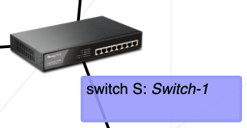

<h1 align="center">
	
 </h1>
 
  

  
  
 
  

 
 ### 🗣️ About

> _This project is a general practical exercise to let you discover networking._

#### 

You will have to configure small-scale networks. To do so, it will be necessary to understand how TCP/IP addressing works.

---

### Index

You're sections headers will be used to reference location of destination.

- [Scheme :twisted_rightwards_arrows:](#scheme)
- [Important concepts](#important-concepts)
- [References 📌](#references)
- [Skills 📄](#skills)
- [Author Info  ✒️](#author)

### Scheme

---

### Important concepts

 #### - TCP 
    
   TCP stands for Transmission Control Protocol a communications standard that enables application programs and computing devices to exchange messages over a network. It is designed to send packets across the internet and ensure the successful delivery of data and messages over networks.
    
#### - IP Address
  
  
  

   The Internet Protocol (IP) is the method for sending data from one device to another across the internet.
   Every device has an IP address that uniquely identifies it and enables it to communicate with and exchange data with other devices connected to the internet.

   IP addressing is a logical means of assigning addresses to devices on a network. Each device connected to the internet requires a unique IP address.

   An IP address has two parts; one part identifies the host such as a computer or other device, and the other part identifies the network it belongs to. TCP/IP uses a subnet mask to separate them.
   
#### - IPv4 vs. IPv6

#### - Switch

#### - Router

#### - Routing Table

  ---

  <b><a href="#index">↥ back to top</a></b>

 

---

#### References

 * [CIDR](https://www.youtube.com/watch?v=C4bLhePgNSg)
 * [Subnet Mask - Explained](https://www.youtube.com/watch?v=s_Ntt6eTn94)
 * [Calculator](https://www.adminsub.net/ipv4-subnet-calculator/192.168.0.1/255.255.255.0)
 * [Network](https://www.youtube.com/watch?v=0XnjQac4jP8&list=PLAp37wMSBouCU49LV0qFbItufigjYk-sp)
 
---

#### Skills

* Rigor
* Network & system administration

---

  ## Author
 
 | [ Jessica Fernanda](https://github.com/nandajfa) |
 | :---: |
 
  

  <b><a href="#index">↥ back to top</a></b>

 
